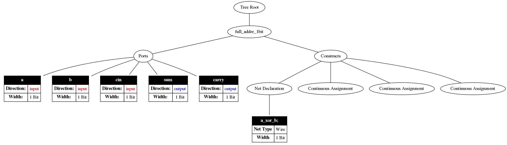

# Verilog Dot

[](https://travis-ci.org/ben-marshall/verilog-dot)

A simple program for generating DOT file representations (graphs) expressing
the syntax tree of a Verilog file. This project is a simple demonstration
of my [Verilog Parser](https://github.com/ben-marshall/verilog-parser).

---

### Getting started

Simply run the following commands to get started and build the library
and the dot file generator.

```sh
$> ./bin/project.sh
$> cd ./build
$> make verilog-dot
```

This creates the CMake `./build/` directory, and checks out the verilog
parser library as a submodule from Github into `./src/verilog-parser`.

### Example usage

After building, you can use the dot file generator thusly:

```sh
$> ./src/verilog-dot --help
Usage: ./verilog-dot [args] [input file]
Options:
-h, --help    - Print this message and quit.
-v, --verbose - Print verbose information messages.
[-o | --output] <FILE PATH> 
              - Specifiy the output file path. By default, 
                is the input path, with .dot appended.

Example:
    ./verilog-dot -v -o module-graph.dot my_module.v

$> ./src/verilog-dot -v -o my-new-graph.v ../tests/simple.v
Input File:  ../tests/simple.v
Output File: my-new-graph.dot
Parsing of input file successful.
Dot file writing complete!
$>
$> dot -Tsvg ../tests/my-new-graph.dot > my-new-graph.svg
```

You can now view my-new-graph.svg, and it will show a rudimentary syntax tree
of the example test file. I say rudimentary because walking the entire tree
is not yet supported, but enough is there to get the idea.

Running the above example on [./tests/simple.v](./tests/simple.v) will give
the following graph as output:


